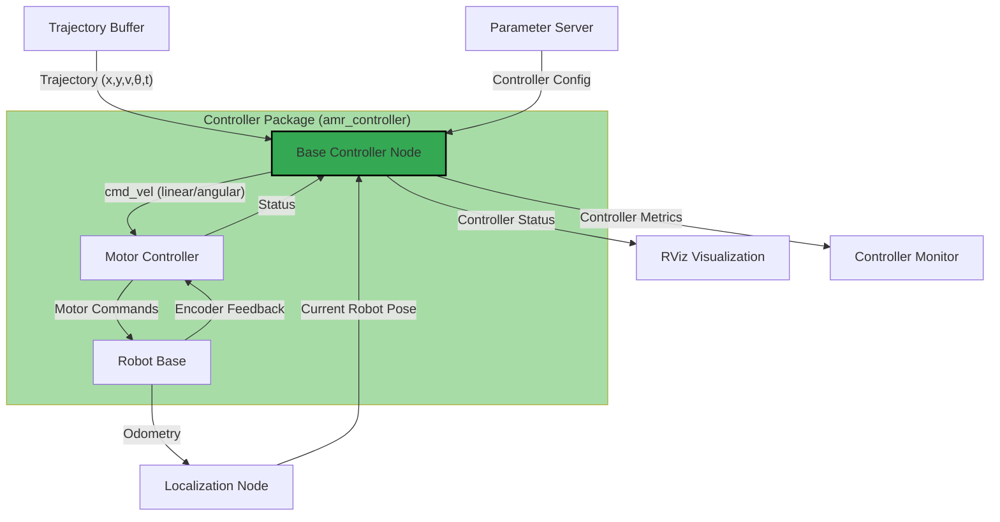

```plaintext
***************************************************************************************************
==================================DO NOT EDIT/REMOVE CONTENT=======================================
==================================DRAFTED BY ABHISHEK NANNURI======================================
***************************************************************************************************
```

