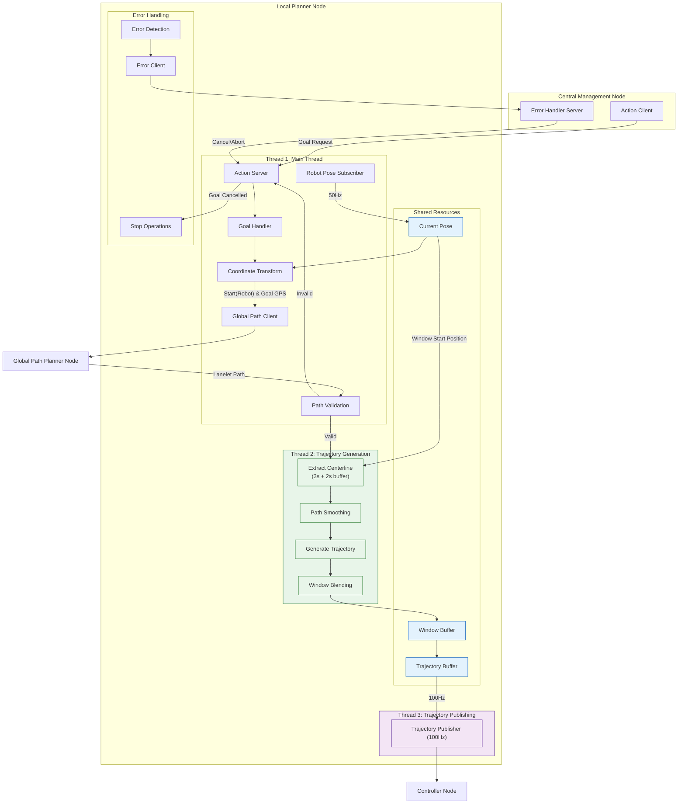

# End-to-End Autonomous Lifecycle and Response System (EALRS) CASE STUDY

************************************************************************************************************************************************************
============================================================FINAL High-Level ARCHITECTURE==========================================================
************************************************************************************************************************************************************

```mermaid
stateDiagram-v2
    [*] --> LaunchSequence

    state "Launch Sequence" as LaunchSequence {
        [*] --> SensorLifecycleNodes

        state "Sensor Lifecycle Nodes" as SensorLifecycleNodes {
            [*] --> Unconfigured
            Unconfigured --> AllUnconfigured: Created
            AllUnconfigured --> LifecycleManager: All Nodes Unconfigured
        }

        state "Lifecycle Manager Node" as LifecycleManager {
            [*] --> InitManager
            InitManager --> RegisterNodes: Register All Sensor Nodes
            RegisterNodes --> ConfigureNodes: All Nodes Registered

            ConfigureNodes --> CheckInactive: Transition All to Inactive
            CheckInactive --> ActivateNodes: All Nodes Inactive
            ActivateNodes --> VerifyActive: Transition All to Active
            VerifyActive --> SensorsReady: All Nodes Active

            state "Failure Handling" as FailureHandling {
                [*] --> CheckError
                CheckError --> TransitionError: Error Detected
                TransitionError --> HandleFailure: Transition Error
                HandleFailure --> DisplayError: Notify Error
                DisplayError --> [*]: Request Relaunch
            }
            ConfigureNodes --> FailureHandling: Error in Configure
            ActivateNodes --> FailureHandling: Error in Activate
        }

        LifecycleManager --> CoreNodes: All Sensors Active
    }

    state "Runtime System" as RuntimeSystem {
        state "Central Management Node" as CentralMgmt {
            [*] --> InitializeCentral
            
            state "Goal Management" as GoalMgmt {
                [*] --> WaitForGoal: Service Server Ready
                WaitForGoal --> ValidateGoal: Service Call
                ValidateGoal --> SendToPlanner: Action Client
                SendToPlanner --> MonitorExecution: Goal Accepted
                
                MonitorExecution --> WaitForGoal: Goal Complete
                ValidateGoal --> WaitForGoal: Invalid Goal
            }
            
            state "Error Handling" as ErrorHandling {
                [*] --> WaitForErrors: Error Server Ready
                WaitForErrors --> ProcessError: Client Request
                ProcessError --> CheckGoalStatus: Get Current State
                CheckGoalStatus --> AbortGoal: Goal Active
                CheckGoalStatus --> SendResponse: No Active Goal
                
                AbortGoal --> WaitResponse: Send Cancel
                WaitResponse --> SendResponse: Goal Cancelled
                SendResponse --> PublishZeroVel: Stop Robot
                PublishZeroVel --> NotifyUser: Display Error
                NotifyUser --> WaitForErrors: Ready
            }
            
            state "Emergency Handler" as EmergencyHandler {
                [*] --> WaitForTrigger: Emergency Server Ready
                WaitForTrigger --> ValidateTrigger: Manual/Switch
                ValidateTrigger --> CheckCurrentGoal: Validate
                CheckCurrentGoal --> TriggerAbort: Goal Active
                CheckCurrentGoal --> EmergencyStop: No Goal
                
                TriggerAbort --> WaitAborted: Send Cancel
                WaitAborted --> EmergencyStop: Goal Cancelled
                EmergencyStop --> StopRobot: Zero Velocity
                StopRobot --> WaitForTrigger: Complete
            }
        }
        
        state "Global Path Planner Node" as GlobalPlanner {
            [*] --> InitPlanner: Service Server Ready
            InitPlanner --> WaitingForRequest: Ready for Path Request
            
            state "Path Validation" as PathValidation {
                [*] --> ValidateStartEnd: Check Start and End GPS
                ValidateStartEnd --> GeneratePath: Find Optimal Path
                GeneratePath --> PathFound: Path Found and Valid
                PathFound --> SendPathData: Send Lanelets and Path Details
                ValidateStartEnd --> PathInvalid: Path Not Available
            }

            WaitingForRequest --> PathValidation: Request Received from Local Planner
        }
        
        state "Local Planner Node" as LocalPlanner {
            [*] --> InitPlanner: Action Server
            InitPlanner --> WaitForGoal: Server Ready
            
            state "Goal Execution" as GoalExecution {
                [*] --> ValidateRequest: Goal Received
                ValidateRequest --> GetGlobalPath: Call Service
                GetGlobalPath --> AcceptGoal: Path Found
                AcceptGoal --> PlanTrajectory: Start Planning
                PlanTrajectory --> PublishTrajectory: Success
                
                ValidateRequest --> RejectGoal: Invalid
                GetGlobalPath --> RejectGoal: No Path
                
                PublishTrajectory --> CheckCancellation: Monitor
                CheckCancellation --> PublishTrajectory: Continue
                CheckCancellation --> AbortGoal: Cancel Request
                
                AbortGoal --> StopPublishing: Clear Queue
                StopPublishing --> WaitForGoal: Ready
            }
        }
        
        state "Controller Node" as Controller {
            [*] --> InitController
            InitController --> StartWatchdog: Ready
            
            state "Trajectory Control" as TrajControl {
                [*] --> WaitTrajectory: Subscribe
                WaitTrajectory --> ValidateData: Message Received
                ValidateData --> ComputeVelocity: Valid
                ComputeVelocity --> PublishCommand: Success
                
                ValidateData --> HandleError: Invalid
                WatchdogTimeout --> HandleError: No Data
                HandleError --> PublishZero: Safety Stop
                
                PublishCommand --> ResetWatchdog: Continue
                ResetWatchdog --> WaitTrajectory: Ready
            }
            
            StartWatchdog --> TrajControl
        }
    }

    LaunchSequence --> RuntimeSystem: Launch Success
    
    note right of CentralMgmt
        Manages goal processing, errors, and emergency stops
        Coordinates system-wide responses
        Handles error propagation from all nodes
    end note
    
    note right of GlobalPlanner
        Processes global path requests from Local Planner
        Validates start and end points
        Sends path data back to Local Planner
    end note
    
    note right of LocalPlanner
        Action server implementation
        Handles path planning and trajectory generation
        Manages goal cancellation and abortion
    end note
    
    note right of Controller
        Implements watchdog timer
        Handles trajectory execution
        Manages emergency stops
    end note


```

Prompts that i  used:

Original Prompt:
If any node failed to launch then display tge issue and ask user to relaunch the launch file.

Launch lifecycle nodes (each sensor will have a lifecycle node and will publish data on to a topic. Main nodes will subscribe to the topic if they need sensor data)

Launch Lifecycle Manager node. This node responsible for transition of sensor lifecycle nodes at same time for synchronization.

If transition from Configure --> inactive --> active fails of any sensor lifecycle node then Lifecycle Manager catches the error and will ask user to fix the sensor and relaunch the launch file.
That behavior is during launching of nodes.
Once all nodes are launched and then goal is being executed and now if any sensor fails and gets error, now Lifecycle Manager node catches error and sends a request to Error/Emergency node that has LocalPlanner action node client and it will trigger the abort goal to local planner and once goal is aborted then we will ask user yo fix the sensor issue and relaunch and give the goal again and mean while we will post 0 vel cmds to controller to make robot halt even though the localplanner stopped to publish the traj points data to controller topic.

And then core nodes will start to launch like localization, global path planner, local planner (it's action server node), controller node.

That is the order of launch. And we will wait for previous node yo launch and we launch next one only if previous one is launched successfully. 
If any node gave error while launching then we will display the error in same terminal on which we launched the launche file including name of node that failed to launch and then we kill all the nodes that are launched successfully and then kill the process (i mean the launch file will be killed) so user have to rerun the launch file after fixing the node tagt failed to launch successfully.

That is the launch process

These are the nodes and their types : 
Lifecycle Nodes: each sensor will have a lifecycle node and publish data on a topic.
Lifecycle Nodes Manager Node: responsible for state transitions of above Lifecycle nodes
Core  Nodes: Localization, Global Path Planner, Controller
Core Nodes with Action Server: Local Path Planner (this node will have an Action server)
Central Management Node: This node is responsible for giveing Goal to the action server (local path planner node), Error hadnling of all other nodes, Emergency Switch.

So we launch the files as per my description above (by running luanch file in terminal 1)

once everything is up and running,

it's time to give the robot goal.

The central management node will have a service server, action server's client.
we will run a cmd in terminal 2:
example cmd: ros2 service call /add_two_ints example_interfaces/srv/AddTwoInts "{'a':2, 'b':5}"
that is an example of how the cmd will look like but we dont use that service server, interface, ..

but the cmd that we will run will have goal gps coords like lat, lon, alt in DD format.

so this a client call that we execute in terminal 2 and it will go call the server which is in central management node. the callback function of tat server will call the action server's client withe the same info of goal position of lat, lon, alt. which inturn will send request and  the local planner's action server will take the input request and it will take those lat, lon, alt o goal position and the local planner will also subscribes to the robot_pose topic data pblished by localization node and it will take the latest robot's pose and convert the data to DD format . i.e now the local planner as both start, end goal loc in DD format and that action server will call the server in global_path_planner node and here we first validate the start, end gps data i.e whether they fall in the bbox boundaries that we defined in global_path_planner_params.yaml file and then chdo initial validations and then get nearest lanelet or area id's w.r.to those start and end gps coords and then find shortest path if available. if it is available then we will send reponse back to teh action server with a success code, vector of lanelet or area id's, vector of bools representing whether the lanelt in previous vector is normal version or the inverse ersion.
based on the response code, if we find the path then reponse will be 1 i.e success and if no path available or gps data is outside bbox area then response code will be 0 i.e failure bssed on that we will decide wheter the goal should be accpeted or rejected. if accepted then we will send accepeted goal reponse back to the action server's clinet which maded the call which is in central management node and then we will send a response back to the terminal saying that goal is validated, found path, orbot in motion. 

Now the Local path planner will do the core processing based on the vector of laneletorarea id's and the bools and by loading the same .osm map of lanelet2 network. like center line extraction, path smoothing, trajj calcluation and trajectory point blending becausewe willfollow the moving windiw approach which calculates everything in 3 sec future = 1or2sec buffer. and at the end the local path planner node will have another publisher which publish the traj points data to /trajectory topic which will be the input for controller node.

nowthe controller node will have a subscriber which takes the data poseted on /trjectory topic and then will do the processing and the post the /cmd_vel data i.e linear, angilar velocities the hardware shiuld follow.

that is the ideal working.

Now if there is any errro in any node (corenodes: localization, glonal path planner, local path planner, controller and im not sure about the sensor's lifecycle nodes) we will have a server client code in those cor nodes and the server will be in cantral managemet node. if we cathch any error then we will send theclient req to the error manaemet server which is in centrla management node and the call wback will initiate the goal cancer/abort/something by usig the action client code which is already in central manaemet node which was used for goal sending initially and that caction client will be triggerred and the wthe cation server in local path planner will cancel/abort based on that and then we will get the conformation from the action server to the client and then we will send response bac to the node that initiated the server acll with reponse code successand msg that goal has been terminated and notified user. 

i have used the server-client comms for errro manemegement becuase i cant use topics becase subscriber should be in central manaememnt node aand the error trigger should b=come from other nodes i.e cpre ndoes and we can only have 1 publisher to topic soserver-c;inet coomms are better here and we are having 1 server in central manaememnt node and the clients will be in all otehr nodes. and server can only process one clinet req at a time but lets say if we have more errors i.e mre nodes caught error and all of them sendclinet reqto the server then we first porcess 1 which will take sometime and once it gets confirmation from action server that goal has been caneclled or terminated or aborted then we firs send confrimation to the clinet that we processed first and then we will update a var that keeps track of the goal status in central manemegement node and we check taht var afor next and the rest cleint req that are in queue and based on that var value we will just send respone to those nodes as well.

I dont know how many clinet requests will be queued in the server ? and i dont know if the clinet req are ignored or rehected if the server is processing 1 req. iam not taklking about action serevr nut normal serve for error manemegent.

and w.r.to the emergency stops. like it can be triggered via terminal 3 or manual switch. we will have anothe server in central maanemenet ndoe which will use the existing actuon clinet nde and then the var that we used to check current status of goal and then if teh goal is still being executed and we instaintiated i.e sent a clinet req to the emergency server then it will send abort goal to teh action server which is executng the goal in local path planner and ten iwe will cancel/abort based on that.

and if the goal is cancelled/aborted/reached then we will not publish the traj points to the trajcetory topic which is input to the controller. so the controller might use the previous traj ponits and the robot still try t o move. so we wshould have a wtchdog or someother maechanism that check the status somehhow but idont know how may be we will have another server client cooms omewhere to notify the controller (pid or mpc) and then post 0 vel cmd_vel messages to teh topic so teh hardware will not move .

prompt for above graph:

amr_local_planner pkg (ROS2)
contains 1 core node (local_path_planner_node): Responsible for Local Pth Trj Calculation mainly.

That node caontains multiple publishers, subscribers., service clients, action server.

this main node uses multiple helper files for modularity.
The main functionality, other comms services will be somehow controlled by the cation server. lets say for exampleAction server's clinet will be somewhere in the central_management node. that node is responsible to call the action server with a goal request.

That goal req will contain goal GPS data to which robot needs to be navigated. 

This node has 1 Subscriber to "robot_pose" topic inorder to get Robot's Current pose data Which was published in Localization node.

So now we have both start gps (we will do the coord transforms from the robot's current pose data ) and end goal gps.

This node will also have 1 service clinet for requesting shortest path if available from start gps, end gps. i.e this clinet will send req to the server "global_path_planner" which is in global_path)_planner_node.

Now that client will be instantiated and then we will sendrequest to the server to find optimal path if available after doing some preliminary checks i mean the global path planner server will do that checks.

we wait till we get response from server and if the response code is success then now we will accept the goal request came from the central management node.
if the response code came from global path planner server is not success then we will reject the goal and along with that we will sens a msg as response to the action server's client so that central_managemet node can display the msg to the user and ask him to fix and provde the goal again as per error.

Now if goal is accepted:
We proceed to trajectory calculation. Since we are assuming there are no dynamic obstacles we dont have to calculate multiple trjectories adn pick best one. so we directly follow the center line of road.

in previous step, we have mentioned that the global_path_planner server will send response so if there is an optimal path then this server will send the vector of lanelet id's and another vector of bool which will indicate whether the corresponding lanelet id at same index is original version or the nverse version of that lanelet because the graph build by the lanelet2 library wil consider both of them as 2 different objects

Now we move into the core local planner pipeline. i.e moving window approach.
we plan the traj of our robot for 3 sec into future + 2 sec for buffer to the next window from current robot pose.

first we extract the ceter line for the dist that robot can move if it is operated at max speed and then smooth the path and then trajectory generation and after that we interpolate or somethukng like that and get the traj points like 100 points a sec. and then we publish those traj piints on to a "trajectory" topic and the controller node will have a subscriber to this topic and will do the control part to control hardware by publising data in cmd_vel.

so we cant do the complete window calculation in a single thread because the publishing of traj points will take time because we are publishing one piunt at a time. so the moving window has to be done in seperate thread and thenstore the data as common resounrce and then it should be used for remainig functionality and then theother thread will move to next window from current pose and we do the blending operation once 2nd window is over and so on....

if we get any error at any place in the local planner node i.e including the mainnode file or the he;per files that we use for modularity in the amr_local_planner pkg, we catch the error and we handle it gracefully without causing any damage to the node and once we catch the error, we will have another service clinet which will call the server "handle_error" or someother name and the server will be in central managememnt node and that node will initiate the goal abprt or cancel request to the cation server in the local planner node. and we will cacel  or abort the goal accordingly and reset all the operations like traj publishing because once goal is aborted the controller should not receive anything and robot has to halt.

