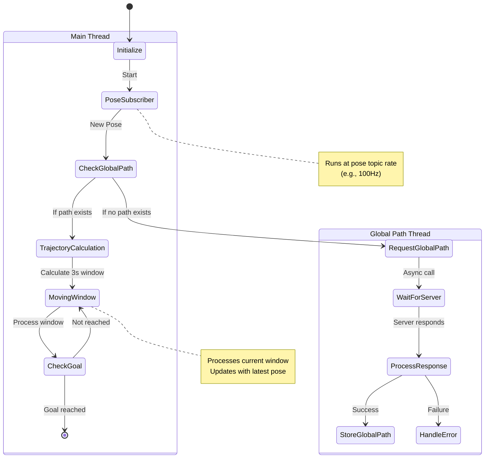
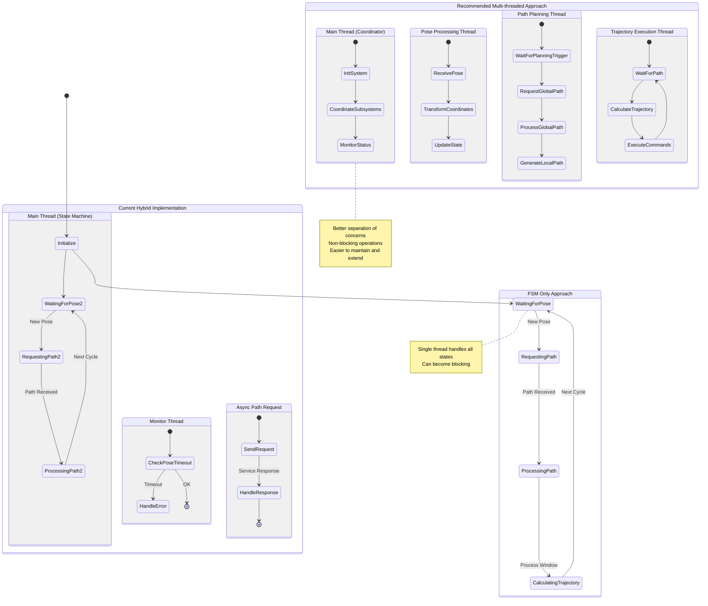
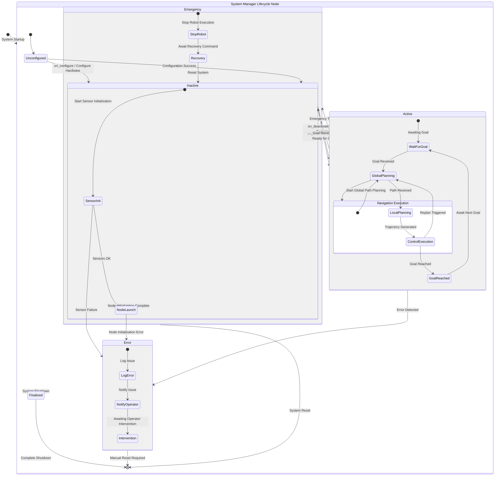

# FINAL LAUNCH & MANAGEMENT ARCHITECTURE CASE STUDY




================ ARM Architecture - FSM (FiniteStateMachines) Vs Threading Model ======================
=============================================g==========================================================





============================== FSM + Multi-Thread + ROS2 native async ==============================


==================================================================================
====================================================================================





************************************************************************************************************************************************************
============================================================FINAL LAUNCH & MANAGEMENT ARCHITECTURE==========================================================
************************************************************************************************************************************************************





```mermaid
stateDiagram-v2
    [*] --> LaunchSequence

    state "Launch Sequence" as LaunchSequence {
        [*] --> SensorNodesLaunch: Launch File Started
        
        state "Sensor Nodes Launch" as SensorNodesLaunch {
            [*] --> Unconfigured: Create Node
            Unconfigured --> Configuring: on_configure()
            Configuring --> Inactive: Success
            Configuring --> LaunchError: Failure
            LaunchError --> [*]: Exit
        }
        
        SensorNodesLaunch --> LifecycleManagerLaunch: OnStartupComplete
        
        state "Lifecycle Manager" as LifecycleManager {
            [*] --> InitializeManager: Create Manager Node
            InitializeManager --> CheckingSensors: Register Managed Nodes
            
            state "Checking Sensors" as CheckingSensors {
                [*] --> WaitForSensors: Subscribe to States
                WaitForSensors --> VerifyConfiguration: All Nodes Present
                VerifyConfiguration --> ConfigurationError: Any Node Missing/Failed
                VerifyConfiguration --> SensorsConfigured: All Nodes Inactive
            }
            
            CheckingSensors --> ConfigurationError: Timeout/Failure
            ConfigurationError --> DisplayError: Publish Diagnostic
            DisplayError --> [*]: Require Restart
            
            CheckingSensors --> SensorsConfigured: All Success
            SensorsConfigured --> TransitionToActive: Trigger Activation
            
            state "Transition To Active" as TransitionToActive {
                [*] --> RequestActive: Call change_state Service
                RequestActive --> WaitForActive: Monitor States
                WaitForActive --> ActivationError: Any Failure
                WaitForActive --> SensorsActive: All Active
            }
            
            TransitionToActive --> ActivationError: Timeout
            ActivationError --> DisplayError
        }
        
        LifecycleManagerLaunch --> LifecycleManager
        LifecycleManager --> CoreNodesLaunch: All Sensors Active
        
        state "Core Nodes Launch" as CoreNodesLaunch {
            [*] --> LaunchPlanner: Start Local Planner
            LaunchPlanner --> LaunchController: OnStartupComplete
            LaunchController --> LaunchMonitor: OnStartupComplete
        }
    }

    state "Runtime System" as RuntimeSystem {
        state "Sensor Monitoring" as SensorMonitor {
            [*] --> InitializeMonitor: Create Monitor Node
            InitializeMonitor --> SubscribeTopics: Create Subscriptions
            SubscribeTopics --> CheckingSensorStates: Start Monitor Timer
            
            state "Checking States" as CheckingSensorStates {
                [*] --> ProcessDiagnostics: Receive Diagnostic Msg
                ProcessDiagnostics --> EvaluateStatus: Check Error Level
                EvaluateStatus --> SensorError: ERROR Level
                EvaluateStatus --> ContinueOperation: OK/WARN Level
            }
            
            SensorError --> EmergencySequence: Trigger Emergency
            ContinueOperation --> CheckingSensorStates: Continue Monitoring
        }

        state "Local Planner" as LocalPlanner {
            [*] --> InitializePlanner: Create Action Server
            InitializePlanner --> WaitingForGoal: Server Ready
            
            state "Goal Execution" as GoalExecution {
                [*] --> ValidateGoal: Receive Goal
                ValidateGoal --> ExecutingGoal: Goal Accepted
                ExecutingGoal --> GeneratePath: Plan Trajectory
                GeneratePath --> PublishingTrajectory: Path Found
                PublishingTrajectory --> WaitingForGoal: Goal Success
                
                ValidateGoal --> RejectGoal: Invalid Goal
                GeneratePath --> AbortGoal: Path Failed
                ExecutingGoal --> AbortGoal: Emergency Stop
            }
            
            WaitingForGoal --> GoalExecution: Action Client Request
        }

        state "Controller" as Controller {
            [*] --> InitializeController: Create Controller Node
            InitializeController --> WatchdogActive: Start Watchdog
            
            state "Watchdog" as Watchdog {
                [*] --> WaitingForData: Initialize Timer
                WaitingForData --> CheckDataTimeout: Timer Callback
                CheckDataTimeout --> StopRobot: Exceeded Threshold
                WaitingForData --> ProcessNewData: Trajectory Msg
                ProcessNewData --> WaitingForData: Reset Timer
            }
            
            WatchdogActive --> ExecuteCommands: Trajectory Available
            ExecuteCommands --> PublishVelocity: Generate Cmd Vel
            PublishVelocity --> WatchdogActive: Continue Control
            
            state "Emergency Stop" as StopRobot {
                [*] --> ZeroVelocity: Stop Command
                ZeroVelocity --> NotifyStop: Publish Status
                NotifyStop --> WaitReset: Await Reset
            }
            
            ExecuteCommands --> StopRobot: Emergency/Timeout
            StopRobot --> WatchdogActive: Reset Complete
        }
    }

    state "Emergency Handler" as EmergencyHandler {
        [*] --> InitializeHandler: Create Handler Node
        InitializeHandler --> WaitingForTrigger: Ready
        
        state "Emergency Processing" as EmergencyProcessing {
            [*] --> ValidateTrigger: Service Called
            ValidateTrigger --> ProcessingEmergency: Valid Request
            ProcessingEmergency --> BroadcastStop: Publish Emergency
            BroadcastStop --> NotifySystem: Set Error State
            NotifySystem --> ResetRequired: Wait for Reset
        }
        
        WaitingForTrigger --> EmergencyProcessing: Error Detected
        ResetRequired --> WaitingForTrigger: Reset Service Called
    }

    LaunchSequence --> RuntimeSystem: Launch Success
    RuntimeSystem --> EmergencyHandler: Error Detected
    EmergencyHandler --> LaunchSequence: Restart Required

    note right of LaunchSequence
        Launch file uses RegisterEventHandler
        to ensure proper startup sequence
    end note

    note right of LifecycleManager
        Monitors managed nodes via:
        - Lifecycle state topics
        - Diagnostic messages
        - Change state services
    end note

    note right of EmergencyHandler
        Provides services for:
        - Manual emergency stop
        - Error state reset
        - System restart
    end note
```

### Architecture Overview

1. **Launch System:** 
   - Uses `OnStartupComplete` to manage launch order for nodes, ensuring dependencies are ready before the next stage.
   - If a sensor node fails, further node launches are prevented, and an error message is displayed.

2. **Emergency Handler:**
   - Provides a service to trigger and reset the emergency stop, enabling manual control.
   - Publishes an emergency stop topic for system-wide shutdowns.

3. **Lifecycle Management:**
   - Utilizes ROS 2 lifecycle nodes with transitions, making error handling and state verification explicit.
   - Configures each node individually, handling failures gracefully and only proceeding once all nodes are active.

4. **Controller with Watchdog Timer:**
   - The watchdog timer checks the frequency of received data and stops the robot if data is stale.
   - Implements preemption for safety, allowing the system to stop gracefully in case of timeout or emergency.

### Detailed Mermaid Diagram


### Implementation Details

#### Launch System with Event Handlers

We use `OnStartupComplete` to ensure that each component in the launch sequence starts in the correct order.

```python
from launch import LaunchDescription
from launch.actions import RegisterEventHandler
from launch.event_handlers import OnStartupComplete
from launch_ros.actions import Node

def generate_launch_description():
    sensor_nodes = [
        Node(package='your_pkg', executable='sensor_node', name='sensor1')
    ]
    
    lifecycle_manager = Node(
        package='your_pkg',
        executable='lifecycle_manager',
        parameters=[{'managed_nodes': ['sensor1']}]
    )
    
    manager_event = RegisterEventHandler(
        OnStartupComplete(
            target_action=sensor_nodes[0],
            on_startup=[lifecycle_manager]
        )
    )
    
    return LaunchDescription([
        *sensor_nodes,
        manager_event
    ])
```

#### Emergency Handler Node

The emergency handler includes a topic to broadcast emergency stop signals and services to trigger or reset the stop manually.

```python
from rclpy.node import Node
from std_msgs.msg import Bool
from std_srvs.srv import Trigger
from rclpy.callback_groups import MutuallyExclusiveCallbackGroup

class EmergencyHandler(Node):
    def __init__(self):
        super().__init__('emergency_handler')
        
        self.service_group = MutuallyExclusiveCallbackGroup()
        self.topic_group = MutuallyExclusiveCallbackGroup()
        
        # Publisher for emergency stop
        self.emergency_pub = self.create_publisher(Bool, 'emergency_stop', 10)
        
        # Service to trigger emergency stop
        self.emergency_srv = self.create_service(
            Trigger,
            'trigger_emergency',
            self.handle_emergency,
            callback_group=self.service_group
        )
        
        # Service to reset emergency stop
        self.reset_srv = self.create_service(
            Trigger,
            'reset_emergency',
            self.handle_reset,
            callback_group=self.service_group
        )

    def handle_emergency(self, request, response):
        msg = Bool(data=True)
        self.emergency_pub.publish(msg)
        response.success = True
        response.message = "Emergency stop triggered."
        return response

    def handle_reset(self, request, response):
        msg = Bool(data=False)
        self.emergency_pub.publish(msg)
        response.success = True
        response.message = "Emergency reset."
        return response
```

#### Lifecycle Manager with State Transitions

The lifecycle manager manages the lifecycle states of sensor nodes, handling errors and activating nodes only when they are fully configured.

```python
from rclpy.lifecycle import Node as LifecycleNode
from lifecycle_msgs.msg import State
from lifecycle_msgs.srv import ChangeState

class SensorLifecycleManager(LifecycleNode):
    def __init__(self):
        super().__init__('sensor_lifecycle_manager')
        self.managed_nodes = {}
        
        # Create change state clients for each node
        for node_name in self.get_parameter('managed_nodes').value:
            client = self.create_client(ChangeState, f'/{node_name}/change_state')
            self.managed_nodes[node_name] = client

    def on_configure(self, state):
        for node_name, client in self.managed_nodes.items():
            future = client.call_async(ChangeState.Request(transition=State.TRANSITION_CONFIGURE))
        return True
```

#### Controller with Watchdog Timer

The controller includes a watchdog timer that will issue a stop command if no data is received within a specified timeout period.

```python
from rclpy.node import Node
from geometry_msgs.msg import Twist
from std_msgs.msg import Empty

class Controller(Node):
    def __init__(self):
        super().__init__('controller')
        self.cmd_vel_publisher = self.create_publisher(Twist, 'cmd_vel', 10)
        self.last_trajectory_time = self.get_clock().now()
        self.watchdog_timer = self.create_timer(0.1, self.watchdog_callback)
        
        self.create_subscription(Empty, 'trajectory', self.trajectory_callback, 10)

    def watchdog_callback(self):
        # Stop if no trajectory data for over 0.5 seconds
        if (self.get_clock().now() - self.last_trajectory_time).nanoseconds / 1e9 > 0.5:
            stop_msg = Twist()  # All velocities zero
            self.cmd_vel_publisher.publish(stop_msg)

    def trajectory_callback(self, msg):
        self.last_trajectory_time = self.get_clock().now()
```

### Key Implementation Points:

- **Launch Order Control:** Ensures sensors start before lifecycle manager; uses `OnStartupComplete`.
- **Lifecycle States:** Manages transitions, verifying each stage before moving to active status.
- **Emergency Stop Handling:** Provides both topic-based (automated) and service-based (manual) controls.
- **Controller Safety:** Watchdog stops the robot on data timeouts, preemptive handling of trajectory errors.

