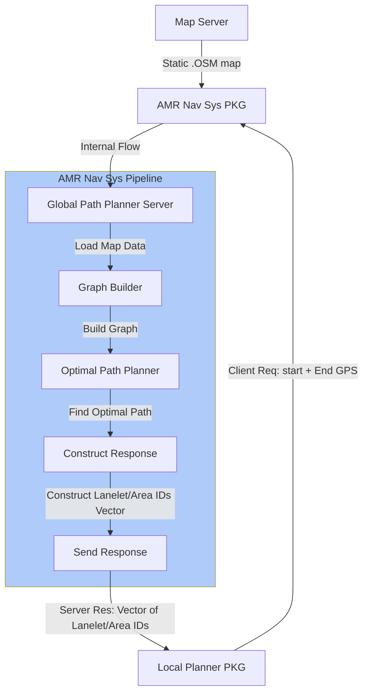

```plaintext
***************************************************************************************************
==================================DO NOT EDIT/REMOVE CONTENT=======================================
==================================DRAFTED BY ABHISHEK NANNURI======================================
***************************************************************************************************
```

                        ============================================================================
                        ===========================Global Path Planner==============================
                        ============================================================================



**Map** = HS-SchmalkaldenPart1.osm

**Client Request:**
- ```plaintext
    # Request
    float64 start_latitude
    float64 start_longitude
    float64 start_altitude    # Default altitude is 0.0
    float64 end_latitude
    float64 end_longitude
    float64 end_altitude      # Default altitude is 0.0
    bool use_time_based_routing
    ```
**Server Response:**
- ```plaintext
    # Response
    int64[] lanelet_ids      # Sequence of IDs (Lanelet or Area or Both) forming the Optimal path
    bool[] is_inverted        # Boolean array indicating if the corresponding lanelet is inverted
    float64 total_distance     # Estimated total distance of the path in meters
    float64 estimated_time     # Estimated time to traverse the path in seconds
    uint8 status              # Status code (0 for success, non-zero for errors)
    string message            # Additional information or error message
    ```
