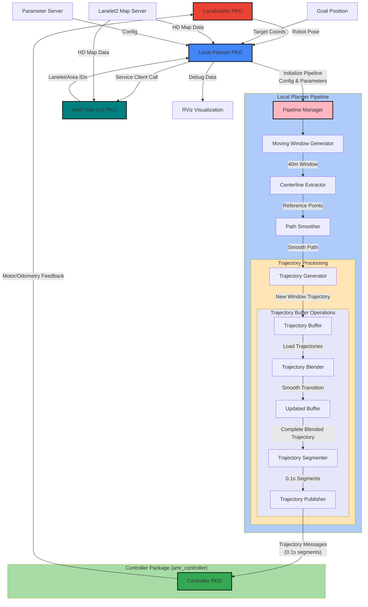
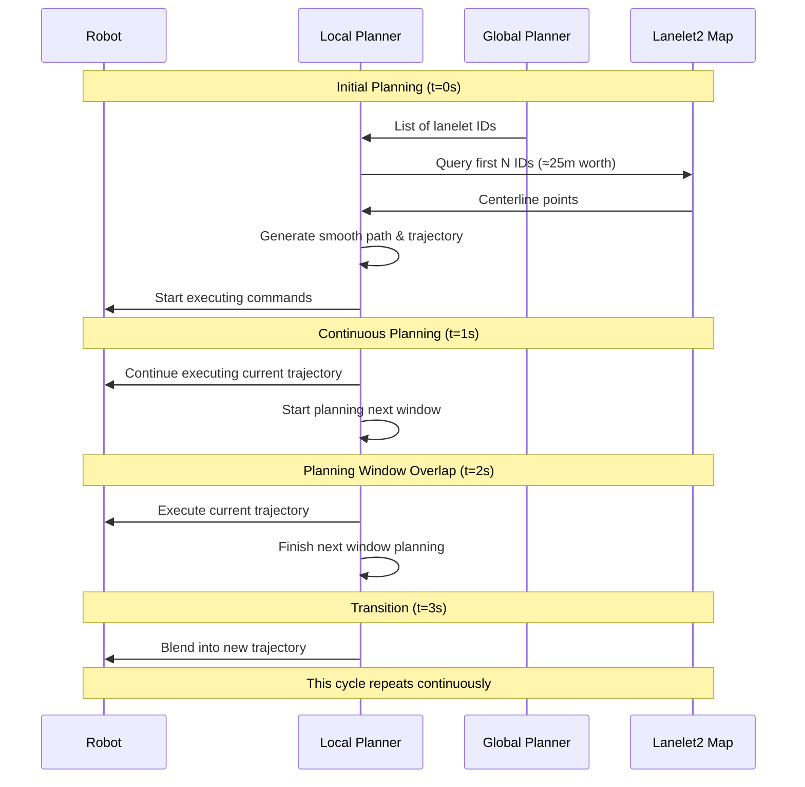

```plaintext
***************************************************************************************************
==================================DO NOT EDIT/REMOVE CONTENT=======================================
==================================DRAFTED BY ABHISHEK NANNURI======================================
***************************************************************************************************
```
# Table of Contents
1. [Local Path Planner Architectural Design](#1-local-path-planner-architectural-design)
2. [Overview](#2-overview)
    1. [Simple Scenario Scope](#21-simple-scenario-scope)
    2. [Key Features](#22-key-features)
3. [System Architecture](#3-system-architecture)
    1. [Core Components](#31-core-components)
    2. [Data Flow](#32-data-flow)
4. [Detailed Process Flow](#4-detailed-process-flow)
   1. [Moving Window Generation](#41-moving-window-generation)
   2. [Centerline Extraction](#42-centerline-extraction)
   3. [Path Smoothing](#43-path-smoothing)
   4. [Trajectory Generation](#44-trajectory-generation)
   5. [Trajectory Tracker](#45-trajectory-tracker)
5. [Window Planning Process](#5-window-planning-process)
   1. [Initial Window at t=0](#51-initial-window)
   2. [Continuous Planning at t=1,...](#52-continuous-planning)
   3. [Timing Considerations](#53-key-points-about-timing)
   4. [Example Execution Timeline](#54-example-execution-timeline)
   5. [Sequential Flow of Windowing](#55-sequential-flow-of-windowing)
6. [Tracking & Feedback Loops](#6-tracking--feedback-loops)
   1. [Trajectory Blending Process](#61-trajectory-blending-process)
   2. [Blend Function](#62-blend-function)
7. [Implementation Tips](#7-implementation-tips)
   1. [Threading Structure](#71-threading-structure)
8. [Future Extensions](#8-future-extensions)
   1. [Dynamic Obstacles](#81-dynamic-obstacles)
   2. [Advanced Features](#82-advanced-features)


# 1. Local Path Planner Architectural Design


# 2. Overview
The local path planner is responsible for generating smooth, feasible trajectories for the AMR (Autonomous Mobile Robot) to follow. This documentation covers both the simple scenario (no dynamic obstacles) and provides architecture for future expansion.

## 2.1 Simple Scenario Scope

- Primarily follows centerline with smoothing
- No dynamic obstacle avoidance
- Focus on smooth trajectory generation
- Operates in human walkable spaces (footpaths, areas)

## 2.2 Key Features

- Continuous planning with overlapping windows
- Parallel processing for planning and execution
- Smooth trajectory blending
- Real-time error handling and replanning

# 3. System Architecture
## 3.1 Core Components
1. Moving Window Generator
2. Centerline Extractor
3. Path Smoother
4. Trajectory Generator
5. Trajectory Tracker

## 3.2 Data Flow
```plaintext
Global Path Planner -> Lanelet IDs -> Moving Window -> Centerlines -> Smooth Path -> Trajectory -> Commands -> Controller
```

# 4. Detailed Process Flow
## 4.1 Moving Window Generation
- **Input**:

    - Current robot position
    - Global path (lanelet IDs)
    - Planning horizon (5-10 seconds)

- **Process**:
    - Don't process all lanelet IDs at once
	- Create a moving window based on robot's current position
    - Window size calculation: robot_speed * planning_horizon
    - Buffer zone addition: active_distance + transition_zone

        - Active: 25m (5 m/s * 5s)
        - Transition: 15m buffer
        - Total planning: 40m

- **Output**:

    - Subset of lanelet IDs for current window

## 4.2 Centerline Extraction
- **Input**:

    - Lanelet IDs within current window

- **Process**:

	- Query Lanelet2 map for each ID
	- Extract centerline points
	- Discretize points with adaptive spacing:
		- Denser points in curves (e.g., 0.2m spacing)
		- Sparser points in straight sections (e.g., 0.5m spacing)

- **Output**:

    - Discretized waypoints

## 4.3 Path Smoothing
- **Technologies**:

    - Cubic splines (simple paths)
    - Bezier curves (transitions)
    - Quintic polynomials (complex maneuvers)

- **Considerations**:

    - Maintain path within navigable space
    - Ensure continuity at transitions
    - Respect kinematic constraints
- **Output**: 
    - A continuous, smooth path that avoids jerky movements and allows the AMR to navigate seamlessly

## 4.4 Trajectory Generation
- **Parameters**:
	- Generate velocity profile considering:
		Maximum velocity constraints (ex: 5 m/s)
		Maximum acceleration/deceleration limits
		Path curvature (slow down in curves)
		Distance to goal
    - Planning horizon: 5 seconds
    ```plaintext
        Trajectory Generator
        → Trajectory Buffer
            → Trajectory Blender
                → Updated Buffer
                    → Trajectory Segmenter
                        → Publisher (0.1s segments)
    ```
    - Discretization interval: 0.1s

- **Outputs**:
    - A time-parameterized trajectory that includes position, velocity, heading, and timestamps for each point. We generate these for entire smooth path. Usually discretized at 0.1s intervals
        - Position (x, y)
        - Velocity
        - Heading
        - Timestamps

## 4.5 Trajectory Tracker
- It continiously Monitors:
   - Expected position/heading from trajectory
   - Actual position/heading from localization
   - Velocity tracking error
- If deviation detected:
   - Small deviations: Controller handles directly
   - Medium deviations: Local planner adjusts commands
   - Large deviations: Trigger replan with new start state
   ```plaintext
        Deviation Thresholds (example):
        - Small: < 0.1m position, < 5° heading
        - Medium: 0.1-0.3m position, 5-15° heading
        - Large: > 0.3m position, > 15° heading
   ```

# 5. Window Planning Process

## 5.1 Initial window:
- At t=0
- Get all lanelet IDs from global planner
- Find which IDs cover first ~40m
- Extract centerlines for these IDs
- Generate smooth path
- Start robot motion

## 5.2 Continuous planning:
- At t=1, ...
- While robot executes current trajectory
- Begin planning next window
- Ensure new plan blends with current trajectory
- Transition smoothly between windows

## 5.3 Key Points about Timing:
- We start planning next window WHILE executing current window
- Planning runs in parallel thread
    - Use separate threads for:
        - Trajectory execution
        - Future window planning
- We have ~3-4 seconds to plan next window
- New plans blend smoothly with current trajectory
- Always maintain buffer distance in planning

## 5.4 Example Execution Timeline:
```plaintext
    t=0s:   - Initial 40m trajectory ready
            - Robot starts moving
            - Planning thread starts working on next segment

    t=1s:   - Robot has moved ~5m
            - Still executing initial trajectory
            - Planning thread working on next segment

    t=2s:   - Robot at ~10m
            - Planning thread completes next segment
            - Preparation for trajectory blending

    t=3s:   - Start blending into new trajectory
            - Planning thread starts on subsequent segment

    t=4s:   - Fully transitioned to new trajectory
            - Cycle continues
```

## 5.5 Sequential Flow of Windowing:



# 6. Tracking & Feedback Loops:

```mermaid
graph TD
    subgraph "Tracking & Feedback Loop"
        LOC[Localization] -->|Actual Position & Heading| LP[Local Planner]
        LP -->|Expected vs Actual Comparison| TRACK[Trajectory Tracker]
        TRACK -->|Adjusted Commands| CTRL[Controller]
        CTRL -->|Motor Commands| ROBOT[Robot Base]
        ROBOT -->|Execution| LOC
    end

    subgraph "Trajectory Blending"
        T1[Original Trajectory] -->|t=0s to t=5s| BLEND[Blending Zone]
        T2[New Trajectory] -->|t=3s to t=8s| BLEND
        BLEND -->|Smooth Transition| FINAL[Final Trajectory]
    end

    subgraph "Planning Windows"
        W1[Window 1: 0-40m] -->|Executing| CUR[Current Position]
        CUR -->|New Planning Start| W2[Window 2: 5-45m]
        W2 -->|Overlap Region| W1
    end
```


## 6.1 Trajectory Blending Process

- Overlap between consecutive trajectories
- Weighted transition over time
- Maintain continuity in velocity and heading

## 6.2 Blend Function
```plaintext
final_trajectory = w1*trajectory1 + w2*trajectory2
where: w1 + w2 = 1
```

Responsibility Split:
- Local Planner: High-level trajectory generation & tracking
- Controller: Low-level motor commands & immediate corrections


# 7. Implementation Tips
## 7.1 Threading Structure
- Thread 1 (Execution):
```plaintext
- Executes current trajectory
- Monitors tracking errors
- Handles immediate adjustments
```
- Thread 2 (Planning):
```plaintext
- Plans next window
- Starts every 1 second
- Generates 40m plan
```


# 8. Future Extensions
## 8.1 Dynamic Obstacles

- Consider Technologies:
    - DWA (Dynamic Window Approach)
    - TEB (Time Elastic Band)
    - Lattice planners
    - RRT* planners
    - Variational planners
    - APF, MPC, Hybrid A**, State Lattice
    **Read the file /home/abhi/ros2_lanelet2_ws/src/ImplementationDesigns/Version0.1.0/MotionPlanning(LocalPlanner + Controller)CaseStudy.md**

## 8.2 Advanced Features

- Multiple path generation
- Obstacle avoidance
- Dynamic replanning
- Pedestrian prediction
