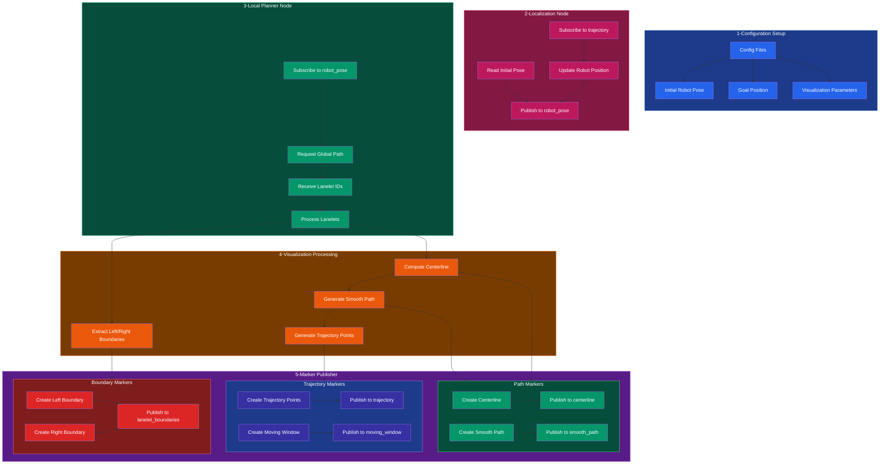

1. **Configuration Setup** (Blue Section)
   - Starts with loading configuration files that contain:
     - Initial robot's position (for simulation)
     - Goal position for path planning
     - Visualization parameters (colors, sizes, update frequencies)

2. **Localization Node** (Pink Section)
   - Two main functions:
     - Reads initial robot pose and publishes it to `/robot_pose`
     - Subscribes to `/trajectory` topic to simulate robot movement
     - Continuously updates and republishes robot position based on trajectory

3. **Local Planner Node** (Green Section)
   - Main planning pipeline:
     - Subscribes to `/robot_pose` to get current position
     - Makes request to global planner with current and goal positions
     - Receives back a list of Lanelet IDs
     - Processes these Lanelets for local planning

4. **Visualization Processing** (Orange Section)
   - Takes processed Lanelets and:
     - Extracts left/right boundary points
     - Computes centerline from boundaries
     - Generates smooth path using centerline
     - Creates trajectory points for robot to follow

5. **Marker Publisher** (Purple Section)
   Has three main subsystems:
   
   a. **Boundary Markers** (Light Red)
   - Creates and publishes left/right boundary visualizations
   - Publishes to `/lanelet_boundaries` topic

   b. **Path Markers** (Light Green)
   - Handles centerline and smooth path visualization
   - Publishes to separate topics:
     - `/centerline` for raw centerline
     - `/smooth_path` for smoothed path

   c. **Trajectory Markers** (Light Blue)
   - Visualizes trajectory points and moving window
   - Publishes to:
     - `/trajectory` for trajectory points
     - `/moving_window` for local planning window

The data flows from top to bottom, with each section building upon the previous ones:
1. Config provides initial setup
2. Localization simulates robot position
3. Local planner processes this position
4. Visualization processing creates displayable data
5. Marker publisher sends everything to RViz
