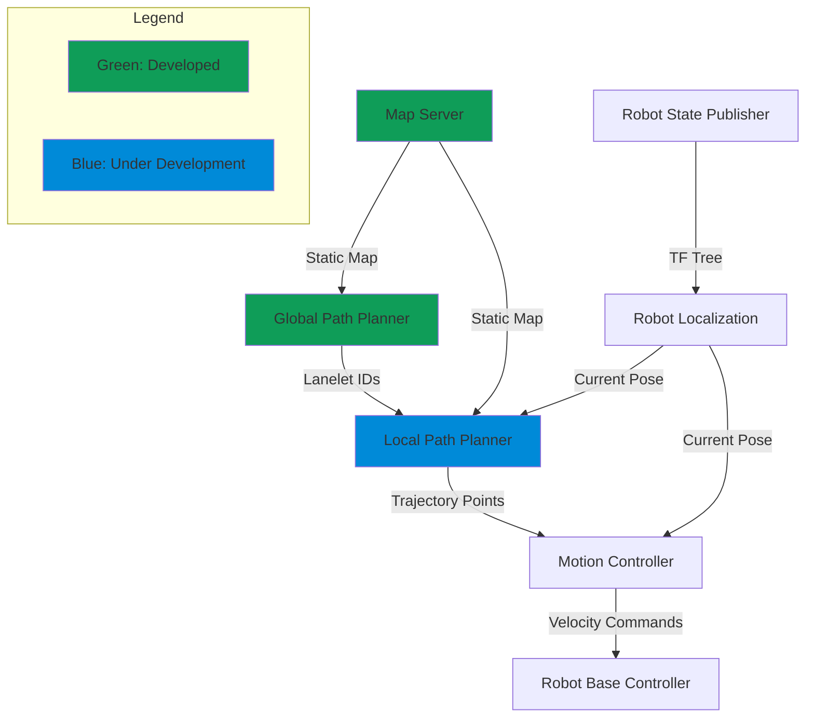
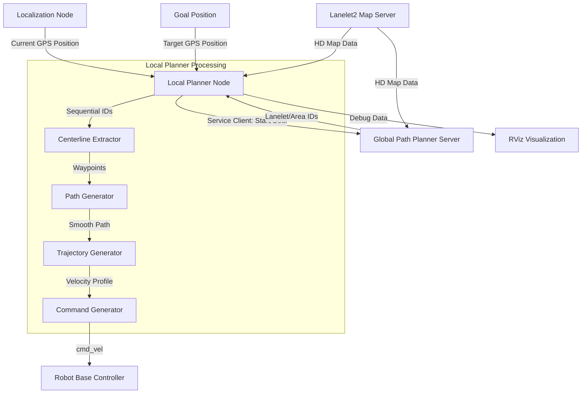
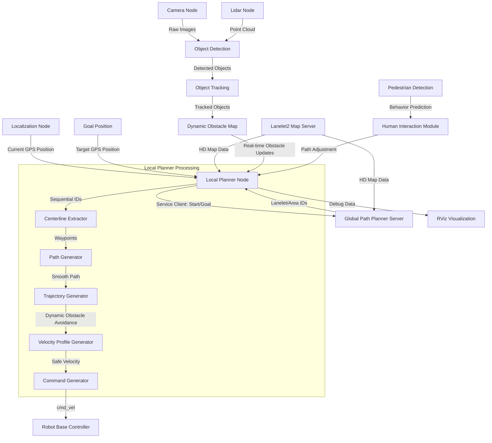

```plaintext
***************************************************************************************************
==================================DO NOT EDIT/REMOVE CONTENT=======================================
==================================DRAFTED BY ABHISHEK NANNURI======================================
***************************************************************************************************
```

                        ============================================================================
                        =========================INITIAL DEVELOPMENT PLAN===========================
                        ===================STAGE 1.0 ---> No Dynamic Obstacles======================
                        ============================================================================



### Explanation:
- **Global Path Planner**: Provides the optimal path as a series of Lanelet IDs.
- **Local Path Planner**: Interprets the Lanelet IDs and generates a series of trajectory points for the local path.
- **Motion Controller**: Converts trajectory points into velocity commands that the AMR can follow.
- **Robot Localization**: Provides the current position (pose) of the AMR, which the local planner and motion controller use to correct the trajectory in real-time.
- **Robot Base Controller**: The final controller that sends the velocity commands to the robot’s actuators.
- **Robot State Publisher**: Publishes the robot's state (pose, transformations) to the ROS TF tree.
- **Map Server**: Provides the static map to the global path planner for route generation.


============================Simple LOCAL PLANNER (With Assumptions: NoDynamic Obstacles, No Perception)==============================



===========================Local Planner - HighLevel===================





====================================================================================

```mermaid

graph TD
    subgraph "Simple Version - Point A to B"
        %% Core Components
        LOC[Localization Node] -->|Current UTM Position| LP[Local Planner]
        GOAL[Goal Position] -->|Target UTM Position| LP
        
        %% Global Planning
        LP -->|Service Client Call| GPS[Global Path Planner Server]
        MAP[Lanelet2 Map Server] -->|HD Map Data| GPS
        GPS -->|Lanelet/Area IDs| LP
        MAP -->|HD Map Data| LP
        
        %% Local Planner Internal Pipeline
        subgraph "Local Planner Pipeline"
            direction TB
            WINDOW[Moving Window Generator] -->|Current Window Size| CE
            CE[Centerline Extractor] -->|Discretized Points| PG
            PG[Path Smoother] -->|Smooth Path| TV
            TV[Trajectory Generator] -->|Velocity Profile| CMD
            CMD[Command Generator] -->|cmd_vel| CTRL
        end
        
        %% Control & Visualization
        CTRL[Base Controller] -->|Motor Commands| ROBOT[Robot Base]
        LP -->|Debug Data| VIZ[RViz Visualization]
        
        %% Parameter Configs
        PARAMS[Parameter Server] -->|Config| LP
    end

    subgraph "Advanced Version - With Perception & Obstacles"
        %% Enhanced Core Components
        LOC2[Localization Node] -->|UTM Position| LP2[Local Planner]
        GOAL2[Goal Position] -->|Target Position| LP2
        
        %% Perception Pipeline
        LIDAR[Lidar Node] -->|Point Cloud| OD[Object Detection]
        CAM[Camera Node] -->|Images| OD
        OD -->|Detected Objects| OT[Object Tracking]
        OT -->|Tracked Objects| BP[Behavior Predictor]
        BP -->|Predicted Trajectories| LP2
        
        %% Enhanced Local Planner
        subgraph "Advanced Local Planner Pipeline"
            direction TB
            WINDOW2[Moving Window Generator] -->|Dynamic Window| CE2[Centerline Extractor]
            CE2 -->|Waypoints| CAND[Candidate Path Generator]
            CAND -->|Multiple Paths| EVAL[Path Evaluator]
            EVAL -->|Best Path| TRAJ[Trajectory Optimizer]
            TRAJ -->|Optimal Trajectory| CMD2[Command Generator]
        end
        
        %% Safety & Control
        SAFETY[Safety Controller] -->|Safety Checks| CMD2
        CMD2 -->|Safe Commands| ROBOT2[Robot Base]
        
        %% Monitoring & Diagnostics
        DIAG[Diagnostics Node] -->|System Status| MONITOR[Monitor UI]
    end

```


