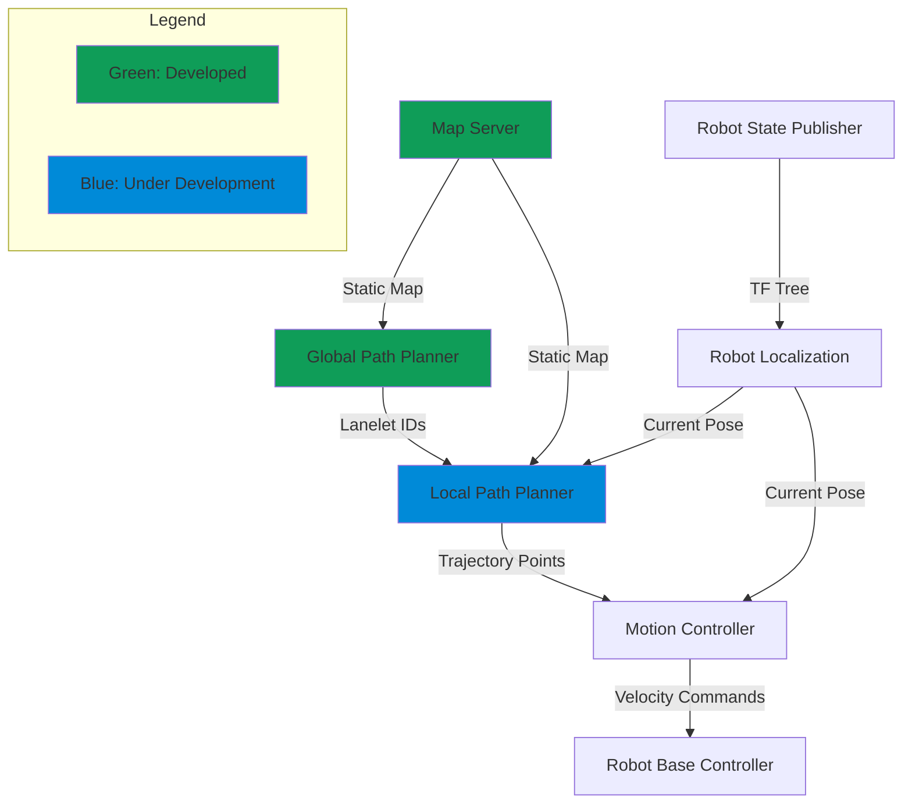
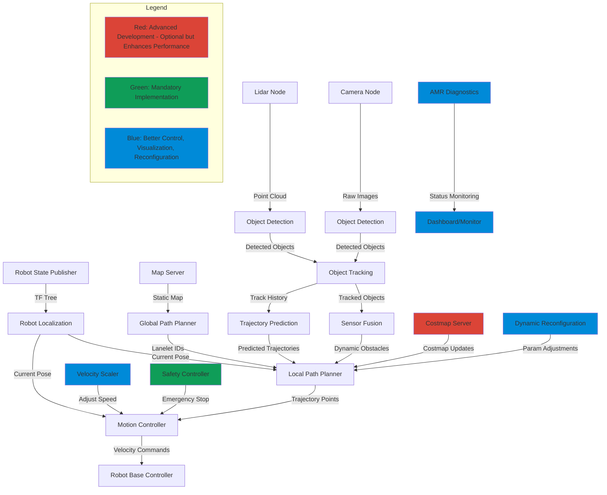
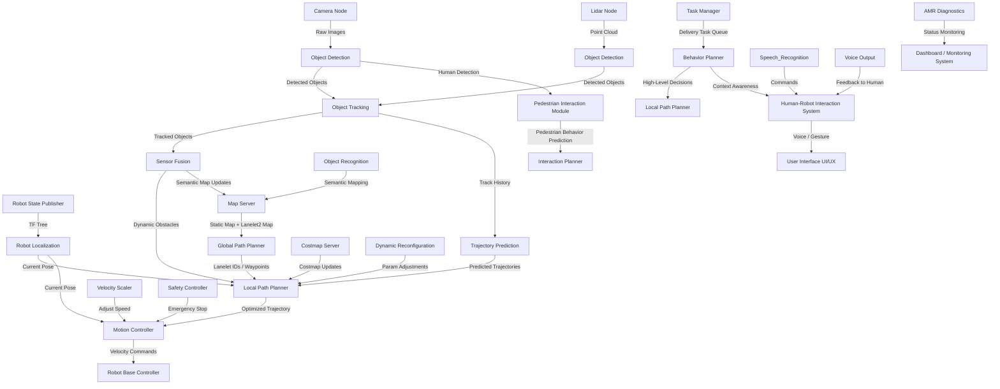

```plaintext
***************************************************************************************************
==================================DRAFTED BY ABHISHEK NANNURI======================================
***************************************************************************************************
```

                        ============================================================================
                        =========================INITIAL DEVELOPMENT PLAN===========================
                        ===================STAGE 1.0 ---> No Dynamic Obstacles======================
                        ============================================================================



### Explanation:
- **Global Path Planner**: Provides the optimal path as a series of Lanelet IDs.
- **Local Path Planner**: Interprets the Lanelet IDs and generates a series of trajectory points for the local path.
- **Motion Controller**: Converts trajectory points into velocity commands that the AMR can follow.
- **Robot Localization**: Provides the current position (pose) of the AMR, which the local planner and motion controller use to correct the trajectory in real-time.
- **Robot Base Controller**: The final controller that sends the velocity commands to the robot’s actuators.
- **Robot State Publisher**: Publishes the robot's state (pose, transformations) to the ROS TF tree.
- **Map Server**: Provides the static map to the global path planner for route generation.

                        ============================================================================
                        ==================ADVANCED ARCHITECTURE DEVELOPMENT PLAN====================
                        ==================STAGE 2.0 ---> With Dynamic Obstacles=====================
                        ============================================================================


### Explanation:
- **Perception Stack**: Adds a perception layer that handles object detection, object tracking, and sensor fusion. The fusion process merges information from different sensors (e.g., camera, lidar) to build an understanding of the environment and feed dynamic obstacles to the local path planner.
- **Object Detection and Tracking**: Detects and tracks obstacles, feeding the information to the local path planner.
- **Trajectory Prediction**: Predicts the future positions of dynamic obstacles and sends predicted trajectories to the local path planner for more advanced obstacle avoidance.
- **Costmap Server**: Maintains an updated costmap to mark obstacles and free space, continuously used by the local path planner.
- **Velocity Scaler**: Dynamically adjusts the AMR's speed based on the environment, slowing down near obstacles or complex areas.
- **Safety Controller**: Monitors the safety of the robot’s movement and can issue emergency stop commands if dangerous conditions arise.
- **AMR Diagnostics**: Continuously monitors the system’s health (battery, motor temperature, etc.) and sends data to a dashboard for real-time status updates.
- **Dynamic Reconfiguration**: Allows on-the-fly parameter adjustment (e.g., obstacle threshold, velocity limits) without restarting the nodes.

This **advanced architecture** adds layers for perception (object detection, tracking, and prediction), dynamic costmap management, safety controls, and diagnostic feedback. This architecture is ready to handle dynamic environments and enables easier future feature integration.

                        ============================================================================
                        ========================ULTIMATE DEVELOPMENT PLAN===========================
                        ============================================================================



## Detailed Breakdown of Subsystems
### 1. **Global and Local Planning**
- **Global Path Planner**: Generates a high-level route using a static map or Lanelet2, providing either Lanelet IDs or waypoints as navigation targets.
- **Local Path Planner**: Breaks down the global path into optimized local trajectories, taking into account the AMR’s current environment and dynamic obstacles.
- **Motion Controller**: Converts the optimized trajectory into velocity and steering commands.
- **Robot Localization**: Tracks the current position of the AMR using SLAM, GPS, or other localization methods.
- **Map Server**: Stores static maps and semantic information, which is updated in real-time with dynamic obstacles and environmental understanding from the perception stack.

### 2. **Perception and Environmental Understanding**
- #### **Perception Stack**:
    - **Camera and Lidar Nodes**: Gather visual and depth data from the AMR's sensors.
    - **Object Detection and Tracking**: Detects obstacles, people, or objects relevant to the AMR's path. Also tracks these objects over time to predict their movements.
    - **Sensor Fusion**: Combines sensor inputs from multiple modalities (camera, lidar, etc.) to provide a comprehensive view of the surroundings.
    - **Dynamic Obstacles**: Identifies and updates the positions of obstacles in real-time, which the local planner uses to avoid collisions.
- #### **Environmental Understanding**:
    - **Human Detection**: Specifically identifies pedestrians and other humans in the AMR's environment.
    - **Object Recognition**: Helps the AMR understand key objects like doorways, signs, or delivery drop zones, updating the Semantic Map.
    - **Pedestrian Interaction Module**: Detects human movement and behaviors to anticipate pedestrian actions and allow safe interactions.
### 3. **Task Planning and Decision-Making**
- **Task Manager**: Manages the delivery tasks, determining which locations to visit and in what order (e.g., multi-stop deliveries).
- **Behavior Planner**: Decides high-level actions such as whether to pause, yield for pedestrians, or change the planned path.
- **Interaction Planner**: Deals with human-robot interactions, particularly in cases where the AMR needs to yield, stop, or notify humans around it.
### 4. **Robot-Human Interaction**
- **Human-Robot Interaction System**: Handles interactions between the AMR and humans through various interfaces, including gestures, voice, and UI feedback.
- **Speech Recognition and Voice Output**: Allows the AMR to receive spoken commands and respond verbally, aiding in tasks such as delivery verification.
- **User Interface (UI/UX)**: Could involve a touchscreen or app-based interface for users to input commands or check the delivery status.
### 5. **Prediction and Advanced Planning**
- **Trajectory Prediction**: Predicts the future movements of dynamic obstacles (like pedestrians or other vehicles) to allow for proactive path adjustments.
- **Pedestrian Behavior Prediction**: Specifically predicts the future actions of nearby humans to ensure safe and efficient navigation in walkable spaces.
### 6. **Additional Modules for Safety, Monitoring, and Reconfiguration**
- **Costmap Server**: Continuously updates the robot's costmap, which includes static and dynamic obstacles.
- **Velocity Scaler**: Dynamically adjusts the robot’s speed depending on the complexity of the environment (e.g., slower near pedestrians or in narrow corridors).
- **Safety Controller**: A safety-critical system that can trigger emergency stops if a collision is imminent or another danger is detected.
- **AMR Diagnostics**: Monitors the robot’s health, including battery levels, motor status, and sensor functionality, and reports this data to a Monitoring Dashboard.
- **Dynamic Reconfiguration**: Allows real-time adjustments of parameters (e.g., max speed, obstacle detection thresholds) without restarting the system.