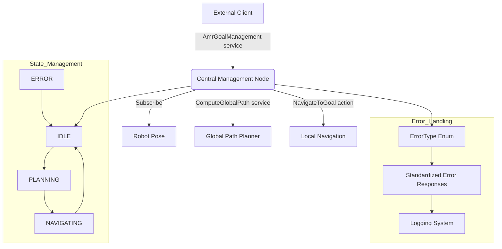

# AMR Central Management Package Summary

The `amr_central_management` package serves as a central orchestration node for an Autonomous Mobile Robot (AMR) system. Let me summarize its key functionality and components.

## Package Overview

This package implements a high-level management system that:

1. Coordinates navigation tasks by interfacing with multiple subsystems
2. Manages goal requests and forwards them to appropriate planning and execution components
3. Maintains the robot's state and handles error conditions systematically
4. Provides coordinate transformation between GPS and local coordinate systems

## Architecture & Data Flow

The central management node acts as an intermediary between external goal requests and the navigation system:

1. Receives goal requests via a service server (`amr_goal_management`)
2. Calls the global path planner service to calculate optimal paths
3. Forwards path plans to the local navigation system via an action interface
4. Tracks navigation progress and reports results/errors

Here's a mermaid diagram illustrating the architecture:



## Key Components

### 1. State Management
The node implements a state machine (`RobotState` enum) with states:
- `IDLE`: Ready to accept new goals
- `PLANNING`: Computing path plan
- `NAVIGATING`: Executing navigation to goal
- `ERROR`: Error condition detected

### 2. Error Handling
A comprehensive error handling system with standardized error types:
- Uses `ErrorType` enum to categorize errors
- Provides consistent error response formatting
- Implements emergency stop capabilities
- Handles timeouts and service failures

### 3. Coordinate Transformation
Converts between GPS coordinates and local map coordinates using a utility from `amr_utils_python` package.

### 4. Asynchronous Processing
- Uses callback groups for concurrent processing
- Implements async/await pattern for service calls
- Uses a multi-threaded executor for improved performance

### 5. Health Monitoring
Periodically checks system health:
- Verifies pose data freshness
- Monitors service availability
- Tracks action execution status

## Service Interfaces

1. **Provided Services:**
   - `amr_goal_management`: Receives GPS goal locations

2. **Used Services:**
   - `global_path_planner`: Requests optimal paths between coordinates

3. **Action Clients:**
   - `navigate_to_goal`: Sends navigation tasks to execution system

## Message Flow

1. Client sends goal GPS coordinates to `amr_goal_management`
2. Node converts current robot position to GPS
3. Node requests path from global planner
4. Path plan is transformed into navigation goal
5. Navigation action is executed and monitored
6. Results are returned to the original client

## Usage

To use this package, you'll need to:
1. Launch the node with proper parameters
2. Ensure the global path planner service is available
3. Have a navigation system that implements the `NavigateToGoal` action
4. Provide robot pose data on the `robot_pose` topic

Here's how to run it:
```bash
ros2 run amr_central_management central_management_node --ros-args --params-file /path/to/central_management_params.yaml
```

The documentation above has been added to the readme.md file in the package.